<div align="center">


<br>

<p>
  <a href="https://github.com/SanjayNivasG"></a>
  <a href="mailto:sanjaynivasgg23it@srishakthi.ac.in"></a>
  <a href="https://linkedin.com/in/sanjay-nivas-g-85568727b"></a>
  <a href="https://leetcode.com/u/SanjayNivasG/"></a>
  
</p>

<p>
  
  
  
</p>


</div>

## 🧭 About Me


```yaml
role: Information Technology Student
focus:
  - Full Stack Development (MERN)
  - DevOps &amp; Cloud Engineering
  - Kubernetes &amp; Container Orchestration
  - Infrastructure as Code
currently_building: Cloud-native applications on AWS + EKS
currently_learning:
  - Advanced Kubernetes Security
  - AWS Solutions Architecture
  - Terraform Modules at Scale
  - Linux Systems Administration
looking_for: Full Stack Developer / DevOps &amp; Cloud Engineer roles
fun_fact: I'd rather write a Terraform module than click through a console
```

<br clear="right"/>


## 🧰 Tech Arsenal

<table>
<tr>
<td valign="top" width="50%">

**Frontend**
<p>

</p>

**Backend**
<p>

</p>

**Database**
<p>

</p>

</td>
<td valign="top" width="50%">

**Cloud &amp; Infra**
<p>

</p>

**CI/CD &amp; Observability**
<p>

</p>

**OS &amp; Tooling**
<p>

</p>

</td>
</tr>
</table>

### 📊 Proficiency

<p>
  
  
</p>
<p>
  
  
</p>
<p>
  
  
</p>

### ☁️ AWS Services Hands-On

| Service | Use Case |
|---|---|
| **EC2** | Provisioning &amp; scaling compute workloads |
| **EKS** | Running production-grade Kubernetes clusters |
| **S3** | Object storage &amp; static hosting |
| **IAM / IRSA** | Fine-grained access control for services &amp; pods |
| **VPC** | Custom network topology, subnets, routing |
| **ALB** | Ingress traffic routing &amp; load balancing |


## 🏗️ How I Ship Software

```mermaid
flowchart LR
    A[💻 Code] --> B[🐳 Docker Build]
    B --> C[🔍 Jenkins CI]
    C --> D[📦 Push to Registry]
    D --> E[🚀 Argo CD Sync]
    E --> F[☸️ AWS EKS Cluster]
    F --> G[📊 Prometheus + Grafana]
    style A fill:#00C4FF,stroke:#181717,color:#000
    style B fill:#2496ED,stroke:#181717,color:#fff
    style C fill:#D33833,stroke:#181717,color:#fff
    style D fill:#6A11CB,stroke:#181717,color:#fff
    style E fill:#EF7B4D,stroke:#181717,color:#fff
    style F fill:#326CE5,stroke:#181717,color:#fff
    style G fill:#E6522C,stroke:#181717,color:#fff
```

<div align="center">



</div>


## 🚀 Featured Projects

<table>
<tr>
<td width="50%" valign="top">

### ☸️ EKS GitOps Pipeline
End-to-end CI/CD on Amazon EKS using **Jenkins → Docker → Argo CD**, with IRSA for secure pod-level AWS access and External Secrets synced from AWS Secrets Manager.

`Jenkins` `Docker` `Kubernetes` `Argo CD` `Terraform`

<!-- <a href="#"></a> -->

</td>
<td width="50%" valign="top">

### 📊 Observability Stack
Full monitoring pipeline for Kubernetes workloads using **Prometheus + Grafana**, with custom dashboards and alerting rules for production troubleshooting.

`Prometheus` `Grafana` `Kubernetes` `Helm`

<!-- <a href="#"></a> -->

</td>
</tr>
<tr>
<td width="50%" valign="top">

### ⚖️ Legal Connect
A MERN-based platform connecting clients with legal professionals, featuring auth, real-time messaging, and case management.

`React` `Node.js` `Express` `MongoDB`

<!-- <a href="#"></a> -->

</td>
<td width="50%" valign="top">

### 🧠 Mental Health Care Platform
A full-stack web app providing mental health resources, appointment booking, and a supportive community space.

`React` `Node.js` `MySQL`

<!-- <a href="#"></a> -->

</td>
</tr>
</table>


## 📈 GitHub Analytics

<div align="center">


</div>

<details>
<summary>🏆 GitHub Trophies</summary>
<br>
<div align="center">

</div>
</details>

<details>
<summary>📅 Contribution Calendar</summary>
<br>
<div align="center">

</div>
</details>

<details>
<summary>🌌 3D Contribution Snake</summary>
<br>
<div align="center">

<p><em>Powered by the Contribution Snake workflow — see setup note below.</em></p>
</div>
</details>


## 🎯 GitHub Metrics Deep-Dive

<div align="center">

</div>


## 🤝 Let's Connect

I'm actively exploring **Full Stack Developer** and **DevOps &amp; Cloud Engineer** opportunities — feel free to reach out for collaborations, internships, or a quick chat about Kubernetes, AWS, or MERN.

<p align="center">
  <a href="mailto:sanjaynivasgg23it@srishakthi.ac.in"></a>
  <a href="https://linkedin.com/in/sanjay-nivas-g-85568727b"></a>
  <a href="https://github.com/SanjayNivasG"></a>
  <a href="https://leetcode.com/u/SanjayNivasG/"></a>
</p>

<div align="center">

### 💬 *"Keep learning. Keep building. Keep improving."*

⭐ **If any of my projects helped you, consider giving them a star!**


</div>
